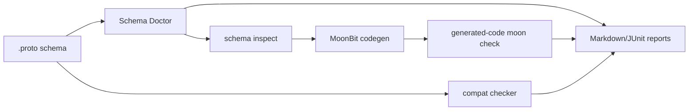

# Reviewer playbook

这份文档面向比赛评审，目标是在 5 分钟内看清 Moon Proto Lab 的项目价值、差异化和可复现性。

## 0. 先看实际运行截图

README 顶部的 `Actual run screenshots for reviewers` 区域包含 4 张由真实命令输出 transcript 渲染得到的 PNG 截图：

- `docs/screenshots/release_gate_pass.png`：`bash scripts/release_gate.sh` 最终通过；
- `docs/screenshots/moon_test_all_targets.png`：`moon test --target all` 多后端测试通过；
- `docs/screenshots/ai_verify_pass.png`：`good_order.proto` AI schema 验证通过；
- `docs/screenshots/schema_doctor_bad_order.png`：`bad_order.proto` 被 Schema Doctor 稳定拒绝。

每张 PNG 都有同名 `.txt` 原始 transcript，包含 command、cwd、timestamp 和 exit code，便于评审核对。

## 1. 项目一句话

Moon Proto Lab 是一个 MoonBit protobuf 生态验证实验室：把 `.proto` schema 从“AI 生成的一段文本”变成可以诊断、可以生成 MoonBit 代码、可以编译、可以做兼容性检查、可以输出报告的工程闭环。

## 2. 不和官方 protobuf 重复在哪里

MoonBit 生态已经存在官方相关项目，例如：

- `moonbitlang/protobuf`
- `moonbitlang/protoc-gen-mbt`

本项目不定位为替代它们，而定位为工具层和验证层：

| 官方 protobuf 栈 | Moon Proto Lab |
| --- | --- |
| 重点是 runtime/codegen 正式实现 | 重点是 schema 诊断、兼容性、oracle fixtures、报告和生成代码可编译检查 |
| 面向生产 protobuf 使用 | 面向 AI 生成代码验证、schema 迁移检查、生态测试夹具 |
| 提供正式协议能力 | 提供验证闭环和差异化测试证据 |

## 3. 先看仓库质量

推荐先打开：

- `README.md`：项目范围、命令、示例；
- `docs/ECOSYSTEM_POSITIONING.md`：与已有生态的差异化；
- `docs/TESTING.md`：测试矩阵；
- `docs/PRE_ACCEPTANCE_FIX.md`：预验收反馈整改说明；
- `.github/workflows/ci.yml`：CI 门禁。

## 4. 一键复现

```bash
bash scripts/release_gate.sh
```

该命令覆盖：

- Python/Go 官方 protobuf oracle fixtures；
- `moon fmt --check`；
- `moon info` 和 `.mbti` diff；
- `moon package`；
- `moon check` / `moon build`；
- `moon test` / `moon test --target all`；
- CLI smoke；
- generated code compile check；
- AI schema 正例/兼容/反例检查。

如果只想看 MoonBit 基础门禁：

```bash
moon fmt --check
moon info
moon package
moon check
moon build
moon test
moon test --target all
```

## 5. AI 验证演示

```bash
python3 scripts/moon_proto_lab.py verify \
  examples/ai/good_order.proto \
  --report generated/ai_good_order_verify_report.md \
  --junit-out generated/ai_good_order_verify_report.xml

python3 scripts/moon_proto_lab.py compat \
  examples/ai/good_order.proto \
  examples/ai/good_order_v2.proto \
  --report generated/ai_good_order_compat_report.md \
  --junit-out generated/ai_good_order_compat_report.xml

python3 scripts/moon_proto_lab.py doctor examples/ai/bad_order.proto
```

前两个命令应通过，最后一个命令应失败并给出稳定诊断。详见 `docs/AI_VERIFICATION_WALKTHROUGH.md`。

## 6. 核心闭环



## 7. 评审建议关注的亮点

- **工程闭环完整**：不是单个函数库，而是 schema、runtime、codegen、CLI、报告、CI 全链路；
- **验证优先**：有 golden vectors、Python/Go oracle、conformance-lite、generated-code compile check；
- **贴合 AI 时代问题**：针对 AI 生成 schema/code 的可验证性和长期维护；
- **生态差异化明确**：不重复官方 protobuf，实现验证和工具补位；
- **可复现交付**：一键 release gate、CI、文档和 JUnit/Markdown 报告。
